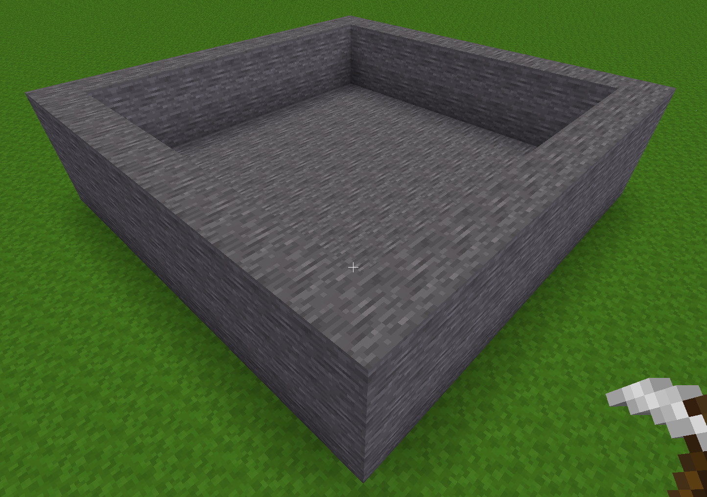
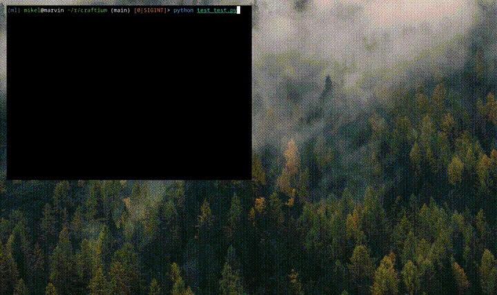

# Creating custom environments

For creating custom environments you need the binary of the original minetest. Thus, the first step is to clone the original repo and build the binary following the instructions [here](https://github.com/minetest/minetest?tab=readme-ov-file#compiling). Note that you should have all the dependencies already met if you have craftium installed in your system.

Once compiled, execute the minetest binary.

```bash
./bin/minetest
```

## Installing the minetest game

If the main menu doesn't display a clouded background with the "MINETEST GAME" banner, you might see the devtest game. Remember that minetest isn't a game per se, it's a game engine, and we'll need a game to build our environment on. Thus, the first step is to install the minetest default game ("minetest game").

Go to the "Content" tab, click "Browse online content", and find and install "Minetest Game". Once installed go to the main menu, a small minetest logo should appear at the bottom of the menu, click it to select the game.


## Adding mods (optional)

Before creating a world, you can install any of the many available mods for Minetest (check [ContentDB](https://content.minetest.net/) for all available mods!). Mods extend Minetest in many possible ways, adding extra functionality to the base minetest game, or can create complete games.

For the sake of example, let's install the [superflat](https://content.minetest.net/packages/srifqi/superflat/) mod. This mod creates a flat world that can be very useful for generating our environments.

To install the mod follow the same process as installing the minetest game: click the `Content` tab in the main menu, then click the `Browse online content` button. Finally, search for `superflat` and install it by clicking the green button with the plus sign:


## Creating the world

In this example, we will start from an empty environment in an infinite and flat world. To create this world, follow the steps from the video below. Note that the created world should be named **world**. Although this can be changed in CraftiumEnv's option we recommend you to keep this name for the sake of simplicity.


### Environment's Lua script

Although environments can be manually created by playing in the newly created minetest world, in this example, we will create the environment using a mod (a Lua script). Creating minetest mods is outside the scope of this tutorial, but there's an excellent [minetest modding book](https://rubenwardy.com/minetest_modding_book/en/index.html) available, and the Minetest's API [reference](https://api.minetest.net/).

Make sure to `cd` into the minetest's installation directory (the original one, not the one modified by craftium), and create a directory inside `mods/` with the name `craftium-builder`.

Then create the following directory structure inside `mods/craftium-builder` with the specified contents:

- `mod.conf`:
```
name = craftium_builder
description = Craftium environment builder script
depends = default
```

- `init.lua`:
```lua
SIZE = 10 -- the size of the room in blocks
HEIGHT = 2 -- walls' height in blocks
MATERIAL = "default:stone"

minetest.register_on_joinplayer(function(_player, _last_login)
    -- Build the floor
    for x=0,SIZE do
       for z=0,SIZE do
          pos = {x = x, z = z, y = 4.5}
          minetest.set_node(pos, { name = MATERIAL })
       end
    end

    -- Build the walls
    for i=0,SIZE do
       for h=1,HEIGHT do
          pos = {x = i, z = 0, y = 4.5 + h}
          minetest.set_node(pos, { name = MATERIAL })

          pos = {x = i, z = SIZE, y = 4.5 + h}
          minetest.set_node(pos, { name = MATERIAL })

          pos = {x = 0, z = i, y = 4.5 + h}
          minetest.set_node(pos, { name = MATERIAL })

          pos = {x = SIZE, z = i, y = 4.5 + h}
          minetest.set_node(pos, { name = MATERIAL })
       end
    end
end)
```

Finally, add the mod to the newly created world, and start the game. When the game starts, press `T` (a chat window should open in the upper part of the screen) and type `/teleport 0,10,0`, this command teleports the player above the created room. You should see a rectangular room of stone blocks as in the video below.


Once the room is created, you can safely remove the `craftium_builder` mod from the `mods/` directory.

The room should look like this:



## Defining the environment

In this step, we will create the mod that defines the mechanics of the environment. The idea is to spawn a red block in a random position of the room, and the player on the other side of the room. If the distance between the player and the red block is less than a threshold, the episode terminates, else, the reward is set to -1 every timestep. Thus, the objective of the agent will be to reach the red block as fast as possible.

Let's create the mod following the same steps as in the previous section. Create the `mods/craftium-env` directory with the following files inside:

- `mod.conf`:
```
name = craftium_env
description = Craftium environment
depends = default
```

- `init.lua`:
```lua
function rand(lower, greater)
    return lower + math.random()  * (greater - lower);
end

SIZE = 10 -- the size of the room in blocks
FLOOR = 4.5 -- height of the floor

-- Executed when the player joins the game
minetest.register_on_joinplayer(function(player, _last_login)
      -- Set the player's initial position
      player:set_pos({x = SIZE / 2, z = 1, y = FLOOR + 1})

      -- --- Spawn a red block inside the room in a random position
      target_pos = {x = rand(1, SIZE-1), z = rand(5, SIZE-1), y = 5.5 }
      minetest.set_node(target_pos, { name = "default:coral_orange" })

      -- Disable HUD elements
      player:hud_set_flags({
            hotbar = false,
            crosshair = false,
            healthbar = false,
      })
end)

-- Executed on every timestep
minetest.register_globalstep(function(dtime)
      -- set timeofday to midday
      minetest.set_timeofday(0.5)

      -- get the first connected player
      local player = minetest.get_connected_players()[1]

      -- if the player is not connected end here
      if player == nil then
         return nil
      end

      -- if the player is connected:

      -- get the position of the player and compute its
      -- distance to he target
      local player_pos = player:get_pos()

      distance = math.pow(target_pos.x-player_pos.x, 2) +
         math.pow(target_pos.z-player_pos.z, 2)

      -- the reward at each timestep is -1
      set_reward(-1.0)

      -- terminate the episode if the distance to the target is
      -- less than a threshold
      if distance < 5.0 then
         set_termination()
      end
end)
```

!!! note "Playing like an agent"

    At this step, you can load the minetest mod and play like an agent. However, note that the functions `set_reward()` and `set_termination` are functions only available in the craftium's modified version of minetest and not in the original minetest binary we are using to create the mod. To play the game like an agent, you have to comment or remove these functions from `init.lua`.

    **⚠️ Warning:** Be sure to leave the world's map in its initial state, otherwise the map will be saved and the initial state of the environment will be modified. For example, if you add or remove a block, be sure to remove or add it before exiting the game.

## Packing the environment

Once the environment is set up, the final step is to create a directory with all the data required to run our environment. First, create the directory (anywhere in your system) where the environment will be saved (for example, `small-room/`).

Then, copy `mods/` (should have only one subdirectory with the mod of the previous step, `craftium-env`), `games/` (only include the `games/minetest_game` subdirectory, exclude `games/devtest`), and `worlds/` (should contain only one subdirectory `worlds/world`) from the minetest's build directory to `small-room/`.

Finally, remove all the data about a player from the environment's world. This is done by removing the players' database: just `rm small-room/worlds/world/players.sqlite`.

## Using the custom environment

We are ready to test our newly created environment!

The following python script should open a window with minetest and the environment loaded and playable!

The only thing you might need to modify is the path to the directory where the environment's data has been saved (`./small-room/` for this example).

```python
import time
import os

from craftium import CraftiumEnv

env = CraftiumEnv(
    env_dir="small-room",
    render_mode="human",
    obs_width=512,
    obs_height=512,
    minetest_dir=os.getcwd(),
)

iters = 1000

observation, info = env.reset()

ep_ret = 0
start = time.time()
for i in range(iters):
    action = dict() # empty action (do nothing)
    observation, reward, terminated, truncated, _info = env.step(action)

    ep_ret += reward
    print(i, reward, terminated, truncated, ep_ret)

    if terminated or truncated:
        observation, info = env.reset()
        ep_ret = 0

end = time.time()
print(f"** {iters} frames in {end-start}s => {(end-start)/iters} per frame")

env.close()
```

The created environment in action 🤠:



As expected, the player and the box start with a random position on opposite sides of the room. Note that the reward at each timestep is -1, making the return more negative over time. When the agent reaches the red box, the episode is terminated and the game is reset.

## Next steps

This tutorial shows a step-by-step guide to implementing a custom environment in minetest. For the sake of clarity, not every detail has been covered in this tutorial, but additional information on how to develop more complex (or simple) environments can be found in the following links:

- **Craftium's environment implementations 🤖.** These are located in the [`craftium-envs`](https://github.com/mikelma/craftium/tree/main/craftium-envs) directory of the [repo](https://github.com/mikelma/craftium).

- **Minetest's [modding book](https://rubenwardy.com/minetest_modding_book/en/index.html) 📖:** the best guide on how to create minetest mods.

- **Minetest's API reference 🔎.** Contains all the available functionalities, and their documentation, of the minetest's Lua API.
