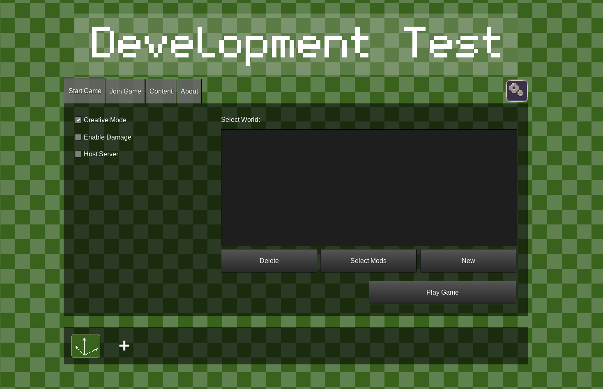
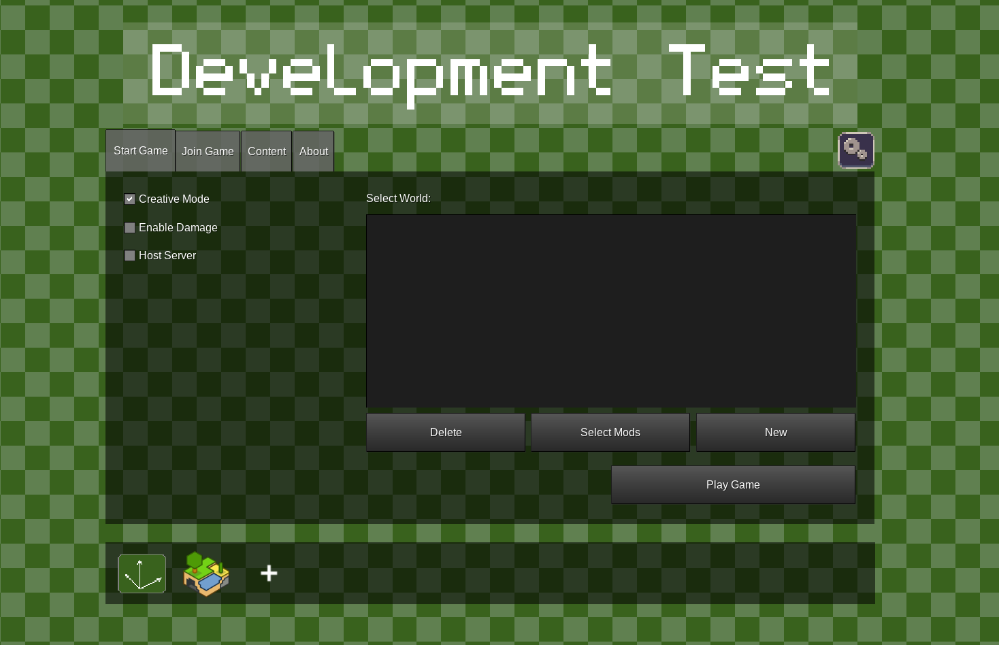
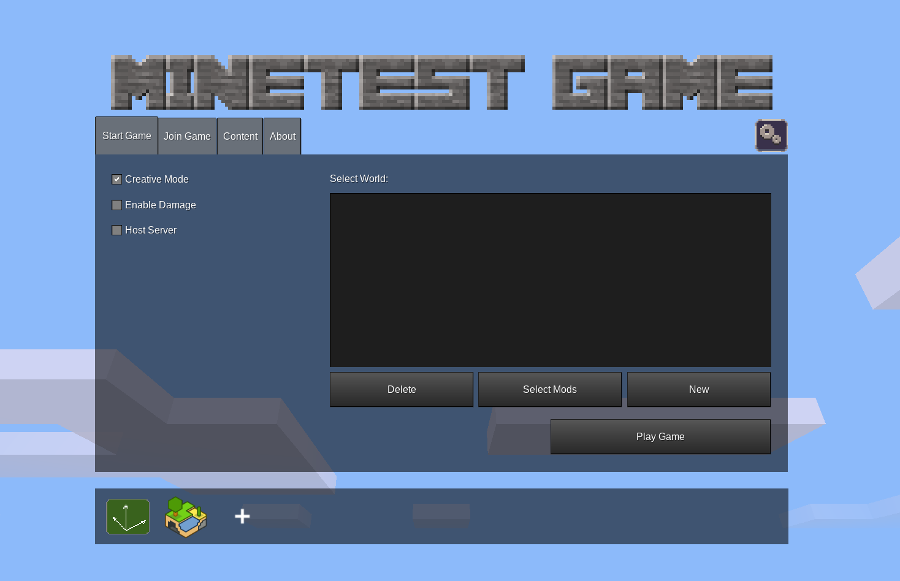

# Creating custom environments

For crating custom environments you need the binary of the original minetest. Thus, the first step is to clone the original repo and build the binary following the instructions [here](https://github.com/minetest/minetest?tab=readme-ov-file#compiling). Note that you should have all the dependencies already met if you have craftium installed in your system.

Once compiled, execute the minetest binary.

```bash
./bin/minetest
```

If the main menu doesn't display a clouds background with the "MINETEST GAME" banner, you might be seen the devtest game. The devtest menu looks like the following:



Remember that minetest isn't a game per se, it's a game engine, an we'll need a game to build our environment on. Thus, the first step is to install the minetest default game ("minetest game").

Go to the "Content" tab, click "Browse online content", and find and install "Minetest Game". Once installed go to the main menu, a small minetest logo should appear in the bottom of the menu:



Click the mintest logo and the menu should look like this:



## Creating the world
