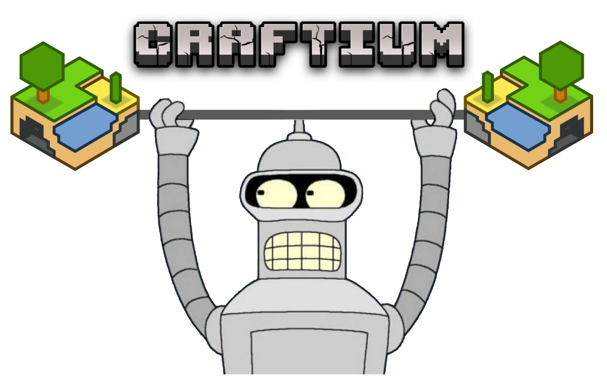

> ✨ *Imagine the features of Minecraft: open world, procedural generation, fully destructible voxel environments... but open source, without Java, easily extensible in [Lua](https://www.lua.org), and with a modern [Gymnasium API](https://gymnasium.farama.org/index.html) designed for RL... This is* **Craftium!** ✨

Craftium is a fully open-source research platform for Reinforcement Learning (RL) research that provides a [Gymnasium](https://gymnasium.farama.org/index.html) wrapper for the [Minetest](https://www.minetest.net/) voxel game engine.

Check the [installation](./installation.md) instructions and the [getting started](./getting-started.md) pages to start using craftium!

- GitHub repository: [https://github.com/mikelma/craftium](https://github.com/mikelma/craftium)

## Features ✨
- **Super extensible 🧩:** Minetest is built with modding in mind! The game engine is completely extensible using the [Lua](https://www.lua.org) programming language. Easily create mods to implement the environment that suits the needs of your research!

- **Modern RL API 🤖:** Craftium slightly modifies Mintest to communicate with Python, and implements the well-known [Gymnasium](https://gymnasium.farama.org/index.html)'s [Env](https://gymnasium.farama.org/api/env/) API. This opens the door to a huge number of existing tools and libraries compatible with this API, such as [stable-baselines3](https://stable-baselines3.readthedocs.io) or [CleanRL](https://github.com/vwxyzjn/cleanrl).

- **Fully open source 🤠:** Craftium is based on the Minetest and Gymnasium, both open-source projects.

- **No more Java ⚡:** The Minecraft game is written in Java, not a very friendly language for clusters and high-performance applications. Contrarily, Minetest is written in C++, much more friendly for clusters, and highly performant!

## Citing Craftium

TODO

## Contributing 🏋️

We really appreciate contributions to craftium! craftium is in an early development stage, so many possible improvements and bugs are expected. If you have found a bug or have a suggestion, please consider opening an [issue](https://github.com/mikelma/craftium/issues) if it isn't already covered. In case you want to submit a fix or an improvement to the library, [pull requests](https://github.com/mikelma/craftium/pulls) are also very welcome!
