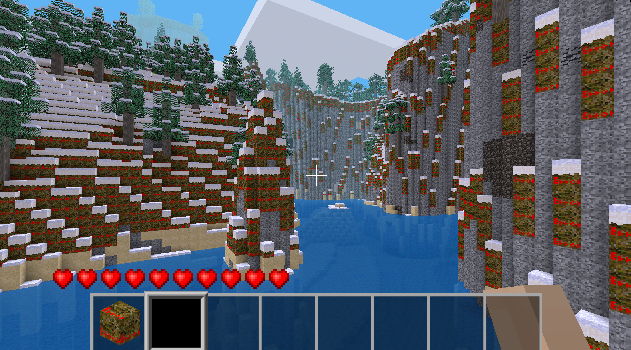

# Observations and actions

## Observation space

Inspired by the [MineRL](https://minerl.readthedocs.io) project, the observation space in craftium is only composed of RGB images of the game (a.k.a frames). By default, the width and height of the image observations are 640x360 pixel RGB images (as in MineRL), but these dimensions can be specified in the `CraftiumEnv`'s initialization function (See API documentation [here](reference.md)).

Observations are RGB images as the following:
<center>

</center>

These observations are defined in Gymnasium using the [`Box`](https://gymnasium.farama.org/api/spaces/fundamental/#gymnasium.spaces.Box) space as:

```python
Box(low=0, high=255, shape=(obs_width, obs_height, 3))
```

where `obs_width` and `obs_height` are defined when creating `CraftiumEnv` (by default, are set to 640 and 360 pixels respectively).

## Action space

Actions in Craftium are compositions of different key pressing and mouse movement commands. Thus, the action space is the Gymnaiusm's composite space [`Dict`](https://gymnasium.farama.org/api/spaces/composite/#dict):

```python
Dict({
    "forward": Discrete(2),
    "backward": Discrete(2),
    "left": Discrete(2),
    "right": Discrete(2),
    "jump": Discrete(2),
    "aux1": Discrete(2),
    "sneak": Discrete(2),
    "zoom": Discrete(2),
    "dig": Discrete(2),
    "place": Discrete(2),
    "drop": Discrete(2),
    "inventory": Discrete(2),
    "slot_1": Discrete(2),
    "slot_2": Discrete(2),
    "slot_3": Discrete(2),
    "slot_4": Discrete(2),
    "slot_5": Discrete(2),
    "slot_6": Discrete(2),
    "slot_7": Discrete(2),
    "slot_8": Discrete(2),
    "slot_9": Discrete(2),
    "mouse": Box(low=-1, high=1, shape=(2,), dtype=np.float32),
})
```

We use 0 or 1 values, "off" and "on" respectively, for key commands (see [`Discrete`](https://gymnasium.farama.org/api/spaces/fundamental/#gymnasium.spaces.Discrete) in the Gymnasium docs), and a list of two floats between -1 and 1 for mouse movements.

In a nutshell, actions in Craftium are a dictionary of some key commands and mouse movements, for example:

```python
{ "jump": 1, "forward": 1, "right": 0, "mouse": [-0.3, 0.0] }
```

This action would cause the player to jump forward and rotate the mouse to the left. Note that it isn't neccessary to provide a value for each possible key. If the value for a key is not given, its default value will be used: `0` ("off") for keys and `[0, 0]` (no movement) for mouse movements.

Note that the craftium's default `Dict` action space might be too complex for many tasks, where useful actions might be a subset of the original space. For this purpose, craftium comes with different `ActionWrappers` that can be used to customize and simplify the default action space. Check the dedicated [page](./wrappers.md) on wrappers and the API [reference](./reference.md) for more info.
