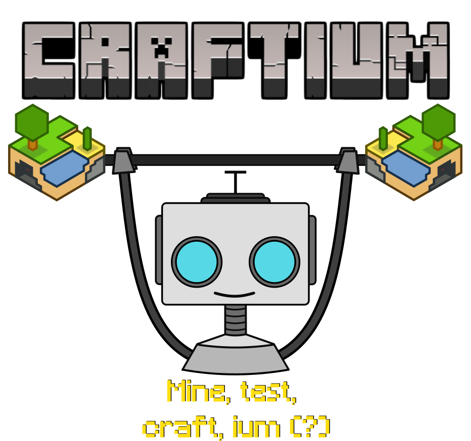
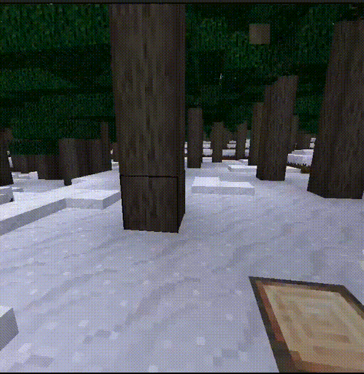
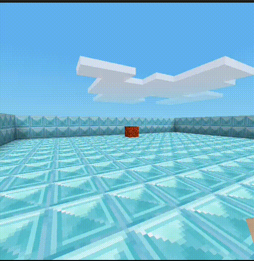
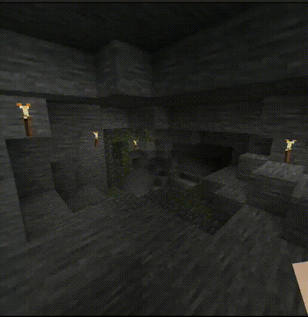

> ✨ *Imagine the features of Minecraft: open world, procedural generation, fully destructible voxel environments... but open source, without Java, easily extensible in [Lua](https://www.lua.org), and with the modern [Gymnasium API](https://gymnasium.farama.org/index.html) designed for RL... This is* **Craftium!** ✨

<center>

</center>

<p align="left">
  
  
  
  
  
</p>


Craftium is a fully open-source platform for creating Reinforcement Learning (RL) environents and tasks that provides a [Gymnasium](https://gymnasium.farama.org/index.html) wrapper for the [Minetest](https://www.minetest.net/) voxel game engine.

Check the [installation](./installation.md) instructions and the [getting started](./getting-started.md) pages to start using craftium!

- GitHub repository: [https://github.com/mikelma/craftium](https://github.com/mikelma/craftium)
- Online documentation: [https://craftium.readthedocs.io/en/latest/](https://craftium.readthedocs.io/en/latest/)
- Paper (ArXiv): [https://arxiv.org/abs/2407.03969](https://arxiv.org/abs/2407.03969)

## Features ✨

- **Super extensible 🧩:** Minetest is built with modding in mind! The game engine is completely extensible using the [Lua](https://www.lua.org) programming language. Easily create mods to implement the environment that suits the needs of your research! See [environments](./environments.md) for a showcase of what is possible with craftium.

- **Extensive documentation 📚:** Craftium extensively [documents](https://craftium.readthedocs.io) how to [use](./getting-started.md) existing [environments](./environments.md) and [create](./creating-envs.md) new ones. The documentation also includes a low-level [reference](./reference.md) of the exported Python classes and gymnasium [Wrappers](./wrappers.md), [extensions to the Lua API](./lua_functions.md), and [code examples](./lua_env_cookbook.md). Moreover, Craftium greatly benefits from existing Minetest documentation like the [wiki](https://wiki.minetest.net/Main_Page), [reference](https://api.minetest.net/), and [modding book](https://rubenwardy.com/minetest_modding_book/en/basics/getting_started.html).

- **Modern RL API 🤖:** Craftium slightly modifies Mintest to communicate with Python, and implements the well-known [Gymnasium](https://gymnasium.farama.org/index.html)'s [Env](https://gymnasium.farama.org/api/env/) API. This opens the door to a huge number of existing tools and libraries compatible with this API, such as [stable-baselines3](https://stable-baselines3.readthedocs.io) or [CleanRL](https://github.com/vwxyzjn/cleanrl).

- **Fully open source 🤠:** Craftium is based on the Minetest and Gymnasium, both open-source projects.

- **No more Java ⚡:** The Minecraft game is written in Java, not a very friendly language for clusters and high-performance applications. Contrarily, Minetest is written in C++, much more friendly for clusters, and highly performant!

## Citing Craftium

To cite Craftium in publications:

```bibtex
@article{malagon2024craftium,
  title={Craftium: An Extensible Framework for Creating Reinforcement Learning Environments},
  author={Mikel Malag{\'o}n and Josu Ceberio and Jose A. Lozano},
  journal={arXiv preprint arXiv:2407.03969},
  year={2024}
}
```

## Contributing 🏋️

We appreciate contributions to craftium! craftium is in early development, so many possible improvements and bugs are expected. If you have found a bug or have a suggestion, please consider opening an [issue](https://github.com/mikelma/craftium/issues) if it isn't already covered. In case you want to submit a fix or an improvement to the library, [pull requests](https://github.com/mikelma/craftium/pulls) are also very welcome!
